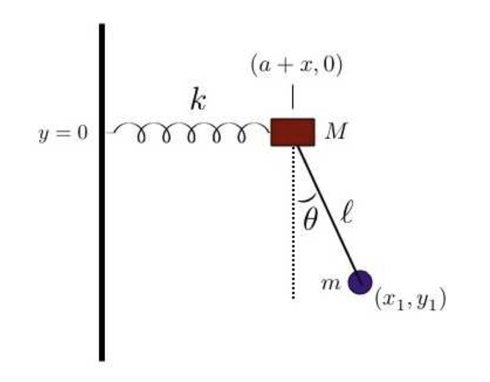

# Several Physical Simulation Projects
* This is the lab projects for CSC 578C in Fall 2018
* The labs use Atlas framework available [here](https://github.com/marovira/atlas)

## Overview
This repository constits of several separate subjects. They are basically some physical simulations of some computer animation topic. These subjects are:
- Simulation of three-body problem
- Practise of Bezier spline
- Simulate spring-pendulum using Lagrangian Mechanics

## Build Instructions
This repository uses cmake. To build the projects in a simplest way, `cd` to the first directory (denoted as top directory in the dir tree below) with `CMakeLists.txt`, and use the following command:
```
mkdir build
cd build
cmake ..
make
```
This will build the executables for each project in the corresponding subdirectories.

## Directory structures
```
.
├── README.md                    
└── labs                            # the top directory    
    ├── data                        # stores object files
    ├── lib                         # atlas framework
    ├── CMakeLists.txt              # top CMakeLists
    └── labs                        # source files for projects
        ├── lab02
        ├── lab03
        ├── lab04
        └── CMakeLists.xtx
```     

## Project structures
Taking the source files of lab02 for example:
```
└── labs02                       
    ├── include                     # header files
    ├── shaders                     # shader files
    └── source                      # source files
        ├── GolfBall.cpp            
        ├── GolfScene.cpp
        └── main.cpp
```
`GolfBall.cpp` is a class that describes the properties of a ball (in this context, a planet). The physical movement is defined by updating the position of the object at the specific `time` in the function `GolfBall::updateGeometry(time)`. Then the object in renderered by the function `GolfBall::renderGeometry(time)`.

`GolfScene.cpp` creates scene with GUI where all render takes place

`main.cpp` triggers the application.

## My contrubution
My work in this project includes but not limit to, mostly implementing the core function, which is, as explained above, `GolfBall::updateGeometry(time)` function. 
Other parts of the project is relied heavily on rendering and GUI, which was not the primary the purpose of this course. The codes was contributed by the TA, who is also the author the [atlas framework](https://github.com/marovira/atlas). 

## Implementation of updateGeometry
According to Newton's second law, 

So we can calculate the acceleration $a$ from the mass and its forces. 
There'are two methods that we can calculate the position of the object. The first methods is to use the equation for absolute time:


The second method was to apply the integration for the diffrentiated time:


 This method is also called Euler Integration.

### The force between planets
According to Newton's law of Universal Gravitation, $$F = \frac{G Mm}{r^2}$$
The forced of each planet is just the sum of all vector gravities that it receives: $$F = \sum_{i=1}^{n}F_i$$

### Bezier Spline
If we're going to construct a Bezier Spline with 4 control points, let `(xc_i,yc_i,zc_i)` denotes the i-th control point, we can compute the `x` coordinate of the point on `t` of the spline,

 where the basis matrix $B$ for Bezier is as follows:
 

The `y` and `z` coordinates can be computed in the same way.

### Spring-pendulum
Let $k$ denotes the spring constant, $M$ denotes the mass of the object attached to the wall with a spring, $m, l$ denotes the mass and length of the pendulum, which is shown as the graph below:

With Lagrangian Mechanics, we can get the following:
1. The kinetic energy is:
  
 The potential energy is: 
 
 So, 
 
2. The canonical momentas:


3. their derivatives of time are:


4. The canonical forces are:


5. because we have
     
    Thus,

1. let ,we can get the second derivatives of  and , which are:

So these two derivatives can be used as accelarations in a polar coordinate system.

## Prensentation
I attached the GIFs which showed the animation of each projects. If you find them interesting, you're welcome to read the code on the implementation. If you have and questions and concerns, don't hesitate to send me an email!